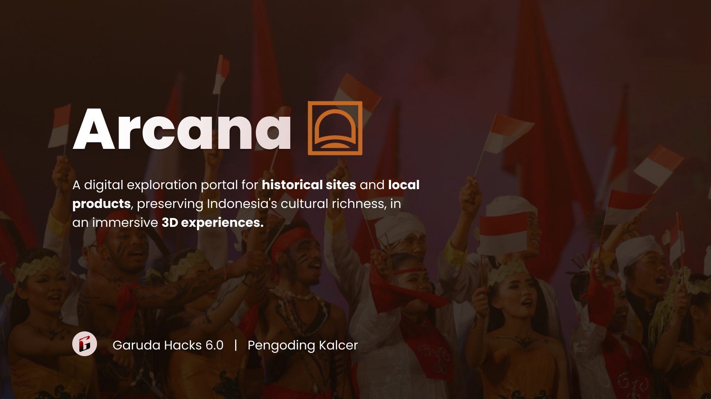

<h1 align="center">ARKANA</h1>

  

## Description

A digital exploration portal for historical sites and local products, preserving Indonesia's cultural richness, in an immersive 3D experiences.

## Background

- 65% of young Indonesians feel a decline in the spirit of nationalism.
- Strong globalization in the modern era also poses a challenge to cultural preservation.
- Chatbot RAG
- Indonesia has cultural diversity that can serve as a key driver for the nation's progress.
 

## Key Features

- Sharing-based mobile web platform for community
- Immersive 3D exploration of historical sites or local artisant product, replacing traditional 2D interfaces
- AI Voice Assistant 
- Marketing of local products for local entrepreneurs.

## Tech Stack

- **Frontend:** Vite
- **Backend:** Hono
- **Database:** PostgreSQL
- **AI Engine:** Gemini, CSM
- **Deployment:** Vercel, Railway

## Our Team
1. Barru Adi Utomo
2. Azfa Radhiyya Hakim
3. Najwa Kahani Fatimah
4. Rafif Farras
---

### Account for Sign In:
username: barru
passwrod: adi